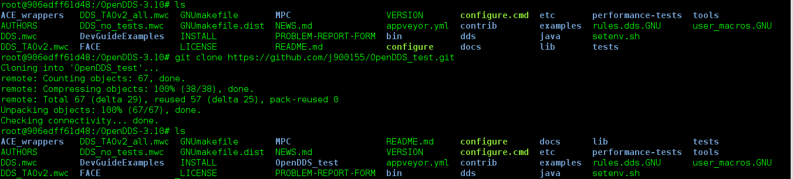
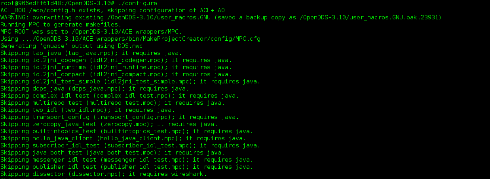
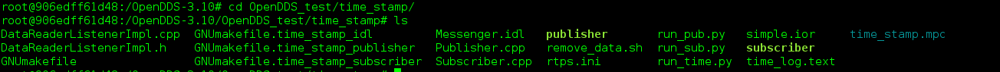
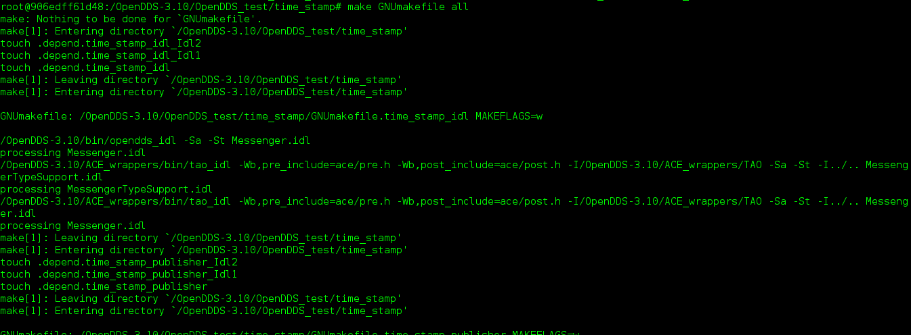

# OpenDDS_test
需要安裝 [OpenDDS](http://opendds.org/) 來使用，並把資料夾移到 OpenDDS 的根目錄底下
執行 ./configure 來生成需要的檔案，即可編譯 

* time_stamp 內為有加時戳標記
* bigger_200 為大於 200byte 的傳輸並加上時戳
* input_cmd 為 c++ 結合 C# 有介面的
# 安裝步驟
在安裝完 OpenDDS 後
1. 執行 git clone https://github.com/j900155/OpenDDS_test.git

2. 執行 ./configure

3.切換目錄到 OpenDDS_test/time_stamp

4. 編譯

   
